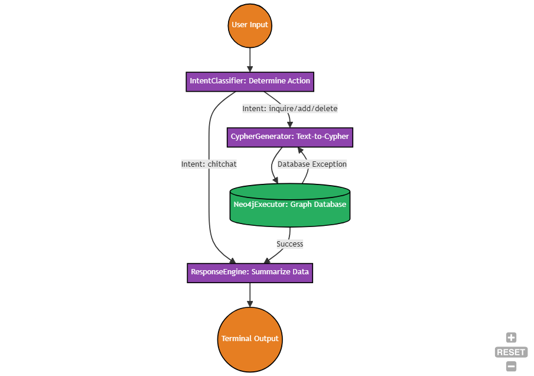

# Adventure Time Lore Keeper (Neo4j)

A conversational AI agent designed to interact with a highly connected Knowledge Graph representing the Adventure Time Universe (Land of Ooo, Finn Mertens, Princess Bubblegum, etc.).

## Features

- **Conversational Memory**: The agent remembers context across interactions during a session, allowing for natural cross-turn follow-up questions.
- **Dynamic Cypher Generation**: Translates natural language requests into complex Neo4j Cypher queries securely.
- **Self-Healing Queries**: If the LLM generates bad Cypher, the system analyzes the Neo4j error and automatically iterates on the prompt to repair the query up to 3 times before failing gracefully.
- **Alias Resolution**: Automatically maps short character nicknames (e.g., "PB", "Jake") to their official canonical names to prevent graph fragmentation.



## Setup Instructions

1. **Install Dependencies:**

```bash
pip install -r requirements.txt
```

2. **Configure Environment:**
   Copy `.env.example` to `.env` and fill in your Neo4j database credentials.
   Configure your LLM provider and explicitly choose your models for classification, Cypher generation, and response styling.

3. **Database Initialization:**
   Ensure your Neo4j database is actively running.
   _Optional:_ Clear out existing nodes by running `python clear_database.py`.
   Populate the Enchiridion with mathematical facts:

```bash
python seed_loader.py
```

4. **Run the Chatbot:**

```bash
python main.py
```

## Example Queries

- **Add:** "Finn Mertens is friends with Jake The Dog."
- **Inquire:** "Who is friends with Finn?"
- **Update:** "Update Marceline's location to the Nightosphere."
- **Delete:** "Delete the Ice King."
- **Chitchat:** "Greetings traveler!"
